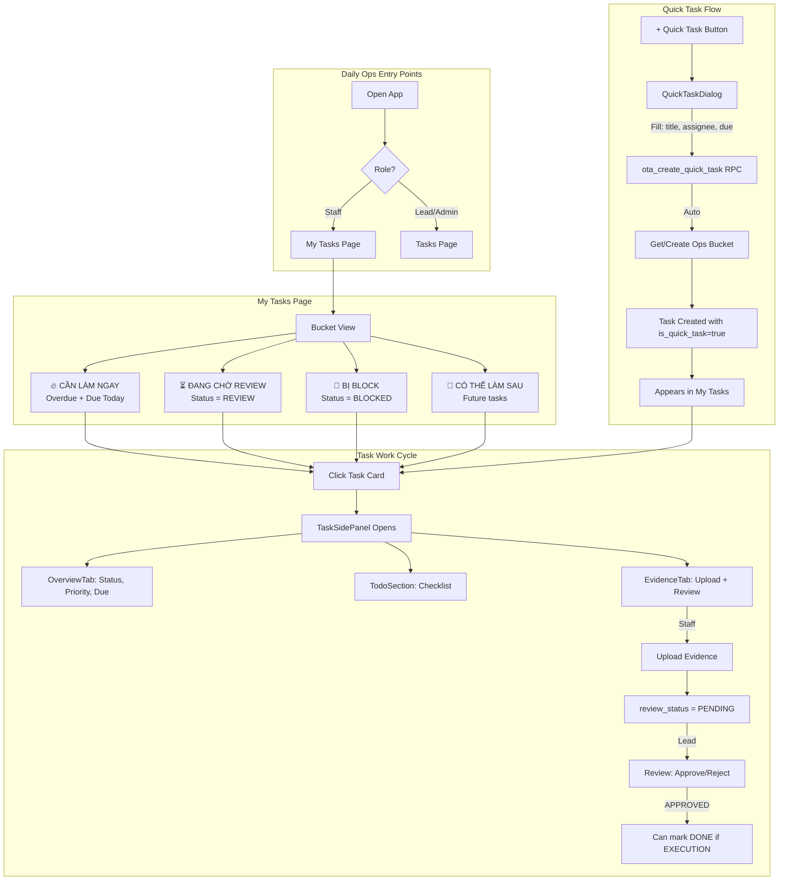
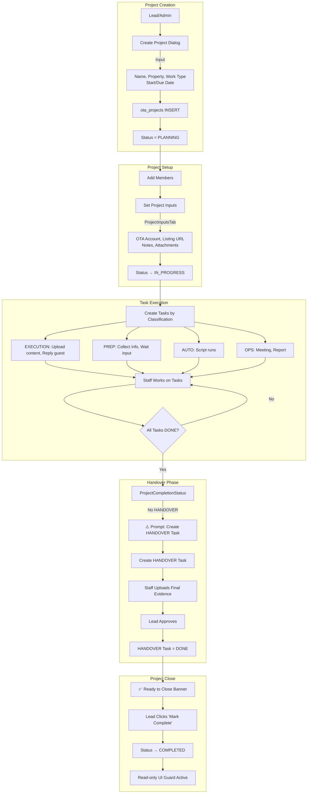
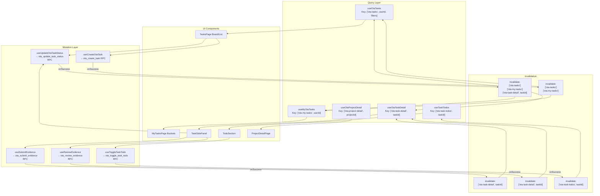

# OTA Operations - Comprehensive System Audit

> **Date:** 2026-01-10  
> **Author:** Principal Product Engineer  
> **Phase:** Full Audit + Development Plan

---

## TABLE OF CONTENTS

1. [Surface UI Inventory](#1-surface-ui-inventory)
2. [Database/Table Inventory](#2-databasetable-inventory)
3. [RPC Inventory](#3-rpc-inventory)
4. [Hook Inventory](#4-hook-inventory)
5. [Dead Feature Inventory](#5-dead-feature-inventory)
6. [Single Source of Truth + ERD](#6-single-source-of-truth--erd)
7. [Data Consistency Rules](#7-data-consistency-rules)
8. [UX Diagrams (Mermaid)](#8-ux-diagrams-mermaid)
9. [Gap Analysis](#9-gap-analysis)
10. [Development Plan P0/P1/P2](#10-development-plan-p0p1p2)
11. [QA Checklist](#11-qa-checklist)

---

## 1. SURFACE UI INVENTORY

### Pages

| Page | Path | File | Description | Status |
|------|------|------|-------------|--------|
| My Tasks | `/ota-operations/my-tasks` | `MyTasksPage.tsx` | Personal tasks với bucket system | ✅ ACTIVE |
| All Tasks | `/ota-operations/tasks` | `TasksPage.tsx` | Board/List/Calendar views | ✅ ACTIVE |
| Projects | `/ota-operations/projects` | `ProjectsPage.tsx` | Project list | ✅ ACTIVE |
| Project Detail | `/ota-operations/projects/:id` | `ProjectDetailPage.tsx` | Project tabs (Overview/Tasks/Members/IO) | ✅ ACTIVE |
| Task Detail | `/ota-operations/tasks/:id` | `TaskDetailPage.tsx` | Full-page task view | ✅ ACTIVE |
| KPI | `/ota-operations/kpi` | `KpiPage.tsx` | Channel performance metrics | ✅ ACTIVE |
| Pending Reviews | `/ota-operations/pending-reviews` | `PendingReviewsPage.tsx` | **STUB - marked for deletion** | 🚫 DEAD |
| My Tasks Enhanced | N/A | `MyTasksPageEnhanced.tsx` | **Not wired - orphan file** | 🚫 DEAD |

### Components

| Component | File | Purpose | Status |
|-----------|------|---------|--------|
| TaskSidePanel | `TaskSidePanel/index.tsx` | Slide-out panel for task details | ✅ ACTIVE |
| ├─ OverviewTab | `tabs/OverviewTab.tsx` | Task info + status | ✅ ACTIVE |
| ├─ EvidenceTab | `tabs/EvidenceTab.tsx` | Evidence CRUD + review | ✅ ACTIVE |
| ├─ CommentsTab | `tabs/CommentsTab.tsx` | Task comments | ✅ ACTIVE |
| ├─ HistoryTab | `tabs/HistoryTab.tsx` | Audit trail | ✅ ACTIVE |
| ├─ TodoSection | `TodoSection.tsx` | Checklist items | ✅ ACTIVE |
| TaskBoardDnd | `TaskBoardDnd.tsx` | Drag-drop Kanban board | ✅ ACTIVE |
| TaskCalendarView | `TaskCalendarView.tsx` | Calendar view | ✅ ACTIVE |
| TaskCard | `TaskCard.tsx` | Card with badges | ✅ ACTIVE |
| QuickTaskDialog | `QuickTaskDialog.tsx` | Quick task creation | ✅ ACTIVE |
| CreateTaskDialog | `CreateTaskDialog.tsx` | Full task creation | ✅ ACTIVE |
| PromoteTaskDialog | `PromoteTaskDialog.tsx` | Promote quick task to project | ✅ ACTIVE |
| ProjectCompletionStatus | `ProjectCompletionStatus.tsx` | HANDOVER + close-ready indicator | ✅ ACTIVE |
| BulkApproveButton | `BulkApproveButton.tsx` | Bulk approve evidence | ✅ ACTIVE |
| SuperAdminOverrideModal | `SuperAdminOverrideModal.tsx` | Override DONE guard | ✅ ACTIVE |

---

## 2. DATABASE/TABLE INVENTORY

| Table/View | Purpose | Key Fields | Linked To | RLS Policy | Used In UI |
|------------|---------|------------|-----------|------------|------------|
| `ota_projects` | Project container | id, name, description, property_id, work_type, status, start_date, due_date, is_ops_bucket, bucket_date | properties_mirror | `is_ota_role() AND has_ota_project_access(id)` | ProjectsPage, ProjectDetailPage |
| `ota_project_members` | Project membership | project_id, user_id, role (STAFF/LEAD/ADMIN), is_active | ota_projects, auth.users | Via project_id | ProjectMembersPanel |
| `ota_tasks` | Task entity | id, project_id, title, status, priority, assignee_id, due_date, classification, is_quick_task, require_evidence | ota_projects | `has_ota_project_access(project_id)` | TasksPage, MyTasksPage, TaskSidePanel |
| `ota_task_evidence` | Evidence attachments | id, task_id, evidence_type, file_url, review_status, reviewed_by | ota_tasks | Via task → project | EvidenceTab |
| `ota_task_comments` | Task comments | id, task_id, content, created_by | ota_tasks | Via task → project | CommentsTab |
| `ota_task_todos` | Checklist items | id, task_id, content, is_done, sort_order | ota_tasks | Via project_members | TodoSection |
| `ota_project_inputs` | Project input data | project_id, data (JSONB), schema_version | ota_projects | `has_ota_project_access(project_id)` | ProjectInputsTab |
| `ota_project_outputs` | Versioned outputs | project_id, version, status, data (JSONB) | ota_projects | `has_ota_project_access(project_id)` | ProjectOutputsTab |
| `ota_audit_log` | Audit trail | action, entity_type, entity_id, old_data, new_data, performed_by | Various | N/A | HistoryTab |

### Enum Types

| Enum | Values | Used For |
|------|--------|----------|
| `ota_project_status` | PLANNING, IN_PROGRESS, ON_HOLD, COMPLETED, ARCHIVED | Project lifecycle |
| `ota_task_status` | TODO, IN_PROGRESS, REVIEW, DONE, BLOCKED, CANCELLED | Task lifecycle |
| `ota_task_priority` | LOW, MEDIUM, HIGH, URGENT | Task prioritization |
| `ota_task_classification` | EXECUTION, PREP, AUTO, OPS | Task type |
| `ota_evidence_type` | SCREENSHOT, DOCUMENT, SPREADSHEET, IMAGE, VIDEO, LINK, NOTE, OTHER | Evidence categorization |
| `ota_evidence_review_status` | PENDING, APPROVED, REJECTED, NEEDS_REVISION | Review workflow |
| `ota_project_role` | STAFF, LEAD, ADMIN | Member roles |
| `ota_work_type` | OTA_SYNC, RATE_ADJUST, PHOTO_UPDATE, LISTING_EDIT, REVIEW_REPLY, INTERNAL_OPS, OTHER | Project type |
| `ota_output_status` | DRAFT, SUBMITTED, APPROVED, REJECTED | Output review workflow |

---

## 3. RPC INVENTORY

| RPC | Params | Returns | Guards | Used By Hook | Used In UI |
|-----|--------|---------|--------|--------------|------------|
| `ota_create_task` | p_project_id, p_title, p_description, p_assignee_id, p_priority, p_due_date, p_classification | JSON {success, task_id} | is_ota_role(), has_ota_project_access() | useCreateOtaTask | CreateTaskDialog |
| `ota_update_task_status` | p_task_id, p_new_status, p_actual_hours | JSON {success} | is_ota_role(), DONE guard (≥1 approved evidence for EXECUTION) | useUpdateOtaTaskStatus | TaskSidePanel, TaskBoardDnd |
| `ota_assign_task` | p_task_id, p_assignee_id | JSON {success} | is_ota_lead_or_admin() | useAssignOtaTask | TaskSidePanel |
| `ota_get_my_tasks` | p_status?, p_project_id? | JSON {success, tasks[]} | is_ota_role(), assignee_id = auth.uid() | useMyOtaTasks | MyTasksPage |
| `ota_get_task_detail` | p_task_id | JSON {success, task, project, evidence[], evidence_summary} | is_ota_role() | useOtaTaskDetail | TaskSidePanel |
| `ota_get_tasks_with_assignees` | p_project_id?, p_status?, p_assignee_id? | JSON {success, tasks[]} | is_ota_role() | useOtaTasksWithAssignees | TasksPage |
| `ota_submit_evidence` | p_task_id, p_evidence_type, p_file_url, ... | JSON {success, evidence_id} | is_ota_role(), has_ota_project_access() | useSubmitEvidence | EvidenceUploadDialog |
| `ota_review_evidence` | p_evidence_id, p_review_status, p_review_notes | JSON {success} | is_ota_lead_or_admin() | useReviewEvidence | EvidenceTab |
| `ota_bulk_approve_evidence` | p_task_ids | JSON {success, approved_count} | is_ota_lead_or_admin() | useBulkApproveEvidence | BulkApproveButton |
| `ota_get_or_create_ops_bucket` | p_bucket_date | JSON {success, project_id, is_new} | is_ota_role() | useGetOrCreateOpsBucket | QuickTaskDialog |
| `ota_create_quick_task` | p_title, p_assignee_id?, p_due_date?, p_classification, p_priority | JSON {success, task_id, project_id} | is_ota_role() | useCreateQuickTask | QuickTaskDialog |
| `ota_promote_quick_task_to_project` | p_task_id, p_target_project_id | JSON {success} | is_ota_role() | usePromoteQuickTask | PromoteTaskDialog |
| `ota_get_task_todos` | p_task_id | TABLE(todo rows) | Project membership | useTaskTodos | TodoSection |
| `ota_add_task_todo` | p_task_id, p_content | UUID (todo_id) | Project membership | useAddTaskTodo | TodoSection |
| `ota_toggle_task_todo` | p_todo_id | BOOLEAN | Project membership | useToggleTaskTodo | TodoSection |
| `ota_delete_task_todo` | p_todo_id | void | Project membership | useDeleteTaskTodo | TodoSection |
| `ota_get_project_detail` | p_project_id | JSON {success, project, task_stats, member_stats} | is_ota_role() | useOtaProjectDetail | ProjectDetailPage |
| `ota_get_project_members` | p_project_id | JSON {success, members[]} | is_ota_role() | useOtaProjectMembers | ProjectMembersPanel |
| `ota_get_project_io` | p_project_id | JSON {success, inputs, latest_output, outputs_list} | has_ota_project_access() | useProjectIO | ProjectInputsTab, ProjectOutputsTab |
| `ota_upsert_project_inputs` | p_project_id, p_data, p_expected_updated_at | JSON {success} | has_ota_project_access() | useUpsertProjectInputs | ProjectInputsTab |
| `ota_create_output_draft` | p_project_id | JSON {success, id, version} | has_ota_project_access() | useCreateOutputDraft | ProjectOutputsTab |
| `ota_update_output_draft` | p_output_id, p_data | JSON {success} | created_by = auth.uid() | useUpdateOutputDraft | ProjectOutputsTab |
| `ota_submit_output` | p_output_id | JSON {success} | has_ota_project_access() | useSubmitOutput | ProjectOutputsTab |
| `ota_review_output` | p_output_id, p_decision, p_reason | JSON {success} | is_ota_lead_or_admin() | useReviewOutput | ProjectOutputsTab |
| `ota_super_admin_override_task_status` | p_task_id, p_override_type, p_reason | JSON {success} | role = super_admin | useSuperAdminOverride | SuperAdminOverrideModal |
| `ota_get_kpi` | p_start_date, p_end_date, p_property_ids?, p_group_by | JSON {success, data[], summary} | is_ota_role() | useOtaKpi | KpiPage |

---

## 4. HOOK INVENTORY

| Hook | Query Key | Calls | Mutations | Invalidate Keys | Used In |
|------|-----------|-------|-----------|-----------------|---------|
| `useOtaProjects` | `['ota-projects', userId, includeOpsBucket]` | Direct table select | N/A | N/A | ProjectsPage |
| `useOtaProject` | `['ota-project', projectId]` | Direct table select | N/A | N/A | ProjectDetailPage |
| `useOtaTasks` | `['ota-tasks', userId, filters]` | Direct + batch (evidence, comments, covers) | N/A | N/A | TasksPage |
| `useMyOtaTasks` | `['ota-my-tasks', userId]` | `ota_get_my_tasks` | N/A | N/A | MyTasksPage |
| `useOtaTasksWithAssignees` | `['ota-tasks-with-assignees', userId, filters]` | `ota_get_tasks_with_assignees` | N/A | N/A | TasksPage |
| `useOtaTaskDetail` | `['ota-task-detail', taskId]` | `ota_get_task_detail` | N/A | N/A | TaskSidePanel |
| `useOtaProjectDetail` | `['ota-project-detail', projectId]` | `ota_get_project_detail` | N/A | N/A | ProjectDetailPage |
| `useTaskTodos` | `['ota-task-todos', taskId]` | `ota_get_task_todos` | N/A | N/A | TodoSection |
| `useCreateOtaTask` | N/A | `ota_create_task` | ✅ | `['ota-tasks']`, `['ota-my-tasks']` | CreateTaskDialog |
| `useUpdateOtaTaskStatus` | N/A | `ota_update_task_status` | ✅ | `['ota-tasks']`, `['ota-my-tasks']`, `['ota-task-detail']` | TaskSidePanel, TaskBoardDnd |
| `useAddTaskTodo` | N/A | `ota_add_task_todo` | ✅ | `['ota-task-todos']` | TodoSection |
| `useToggleTaskTodo` | N/A | `ota_toggle_task_todo` | ✅ (optimistic) | `['ota-task-todos']` | TodoSection |
| `useDeleteTaskTodo` | N/A | `ota_delete_task_todo` | ✅ (optimistic) | `['ota-task-todos']` | TodoSection |
| `useSubmitEvidence` | N/A | `ota_submit_evidence` | ✅ | `['ota-task-detail']` | EvidenceUploadDialog |
| `useReviewEvidence` | N/A | `ota_review_evidence` | ✅ | `['ota-task-detail']` | EvidenceTab |
| `useBulkApproveEvidence` | N/A | `ota_bulk_approve_evidence` | ✅ | `['ota-pending-reviews']`, `['ota-task-detail']` | BulkApproveButton |
| `useProjectIO` | `['ota-project-io', projectId]` | `ota_get_project_io` | N/A | N/A | ProjectInputsTab, ProjectOutputsTab |
| `useUpsertProjectInputs` | N/A | `ota_upsert_project_inputs` | ✅ | `['ota-project-io']` | ProjectInputsTab |
| `useCreateQuickTask` | N/A | `ota_create_quick_task` | ✅ | `['ota-tasks']`, `['ota-my-tasks']` | QuickTaskDialog |
| `useSuperAdminOverride` | N/A | `ota_super_admin_override_task_status` | ✅ | `['ota-tasks']`, `['ota-my-tasks']`, `['ota-task-detail']` | SuperAdminOverrideModal |

---

## 5. DEAD FEATURE INVENTORY

| UI Element | Exists? | Backend Exists? | Hook Exists? | Status | Action |
|------------|---------|-----------------|--------------|--------|--------|
| `PendingReviewsPage.tsx` | ✅ STUB | ✅ RPCs kept | ✅ Used elsewhere | 🚫 DEAD | **DELETE file** |
| `MyTasksPageEnhanced.tsx` | ✅ FILE | N/A | ✅ Same hooks | 🚫 ORPHAN | **DELETE file** |
| `/ota-operations/pending-reviews` route | ❌ NO route | N/A | N/A | ✅ CLEAN | No action |
| Bulk Approve on separate page | ❌ Removed | ✅ RPC kept | ✅ Used in EvidenceTab | ✅ WORKING | No action |

---

## 6. SINGLE SOURCE OF TRUTH + ERD

### Entity Ownership

| Entity | SSOT Table | Key Relationships |
|--------|------------|-------------------|
| Project | `ota_projects` | → properties_mirror (property_id) |
| Task | `ota_tasks` | → ota_projects (project_id), → auth.users (assignee_id) |
| Evidence | `ota_task_evidence` | → ota_tasks (task_id) |
| Todo | `ota_task_todos` | → ota_tasks (task_id) |
| Comment | `ota_task_comments` | → ota_tasks (task_id) |
| Project Member | `ota_project_members` | → ota_projects, → auth.users |
| Project Input | `ota_project_inputs` | → ota_projects (1:1) |
| Project Output | `ota_project_outputs` | → ota_projects (1:N versioned) |
| Audit Log | `ota_audit_log` | → entity_type + entity_id (polymorphic) |
| Quick Task | `ota_tasks` (same table) | is_quick_task = true, project = Ops Bucket |
| Handover | `ota_tasks` (same table) | classification = OPS, title contains [HANDOVER] |

### ERD (Text Format)

```
┌─────────────────┐       ┌─────────────────┐
│ properties_mirror│       │   auth.users    │
│─────────────────│       │─────────────────│
│ id (PK)         │       │ id (PK)         │
│ property_name   │       │ email           │
└────────┬────────┘       └────────┬────────┘
         │                         │
         │ property_id             │ user_id
         ▼                         ▼
┌─────────────────────────────────────────────┐
│              ota_projects                    │
│─────────────────────────────────────────────│
│ id (PK)                                      │
│ name, description                            │
│ property_id (FK → properties_mirror.id)      │
│ work_type (ENUM)                             │
│ status (ENUM)                                │
│ start_date, due_date, completed_at           │
│ is_ops_bucket, bucket_date                   │
│ created_by, updated_by (FK → auth.users)     │
└──────────────────┬──────────────────────────┘
                   │ project_id (1:N)
     ┌─────────────┼─────────────┐
     ▼             ▼             ▼
┌──────────┐ ┌──────────┐ ┌───────────────┐
│ota_tasks │ │ota_project│ │ota_project    │
│          │ │_members   │ │_inputs/outputs│
└────┬─────┘ └──────────┘ └───────────────┘
     │
     │ task_id (1:N)
     ├─────────────┬─────────────┬─────────────┐
     ▼             ▼             ▼             ▼
┌──────────┐ ┌──────────┐ ┌──────────┐ ┌──────────┐
│ota_task_ │ │ota_task_ │ │ota_task_ │ │ota_audit │
│evidence  │ │comments  │ │todos     │ │_log      │
└──────────┘ └──────────┘ └──────────┘ └──────────┘
```

### Key Field Reference

| Field | Location | Purpose |
|-------|----------|---------|
| `project_id` | ota_tasks, ota_project_members, ota_project_inputs/outputs | Link to project |
| `task_id` | ota_task_evidence, ota_task_comments, ota_task_todos | Link to task |
| `assignee_id` | ota_tasks | Link to user |
| `created_by`, `reviewed_by` | Multiple tables | Audit trail |
| `status` | ota_projects, ota_tasks | Lifecycle state |
| `classification` | ota_tasks | EXECUTION/PREP/AUTO/OPS |
| `require_evidence` | ota_tasks | DONE guard flag |
| `review_status` | ota_task_evidence | PENDING/APPROVED/REJECTED/NEEDS_REVISION |
| `is_quick_task` | ota_tasks | Quick Task flag |
| `is_ops_bucket` | ota_projects | Daily Ops Bucket flag |

---

## 7. DATA CONSISTENCY RULES

### DONE Guard Rules

| Classification | Evidence Required | Min Evidence Count | DONE Guard |
|---------------|------------------|-------------------|------------|
| EXECUTION | ✅ Yes | ≥1 APPROVED | ✅ Enforced by trigger + RPC |
| PREP | ❌ No | 0 | ❌ Not enforced |
| AUTO | ❌ No | 0 | ❌ Not enforced |
| OPS | ❌ No | 0 | ❌ Not enforced |

**Trigger:** `tr_ota_task_done_guard` on `ota_tasks`  
**RPC:** `ota_update_task_status` checks `ota_task_has_approved_evidence()`

### Project Completion Rules

1. **All tasks DONE** → Show HANDOVER prompt
2. **HANDOVER task exists + DONE** → Show "Ready to close" banner
3. **Project status = COMPLETED** → Read-only UI guard (Sprint C)

### Evidence Immutability (Model A)

- **IMMUTABLE fields:** task_id, evidence_type, file_url, file_name, description, created_at, created_by
- **MUTABLE fields:** review_status, reviewed_at, reviewed_by, review_notes
- **Enforced by:** `tr_ota_task_evidence_immutability` trigger

### Todo Does NOT Gate DONE

- Todo checklist is informational only
- Todo completion does NOT affect task DONE status
- No trigger or RPC check for todo completion

### Quick Task Semantics

- Quick Task = Task with `is_quick_task = true`
- Attached to Daily Ops Bucket project (not orphan)
- Can be promoted to regular project via `ota_promote_quick_task_to_project`
- `project_id` remains NOT NULL (RLS safety preserved)

---

## 8. UX DIAGRAMS (MERMAID)

### 8.1 Daily Ops Flow (My Tasks + Quick Task)



### 8.2 Project Flow (Create → Execute → Handover → Close)



### 8.3 Task Detail Panel Flow

```mermaid
flowchart TD
    subgraph "Open Panel"
        A[Click Task Card] --> B[taskPanelActions.open taskId]
        B --> C[TaskSidePanel Renders]
        C --> D[useOtaTaskDetail RPC]
        D --> E[Fetch: task, project, evidence[], evidence_summary]
    end
    
    subgraph "Panel Tabs"
        E --> F[PanelTabs]
        F --> G[OverviewTab]
        F --> H[EvidenceTab]
        F --> I[CommentsTab]
        F --> J[HistoryTab]
    end
    
    subgraph "OverviewTab Actions"
        G --> G1[View Task Info]
        G1 --> G2[Update Status]
        G2 -->|useUpdateOtaTaskStatus| G3[RPC + Invalidation]
        G1 --> G4[Update Priority/Due Date]
        G4 -->|useUpdateOtaTaskPriority/DueDate| G5[Direct Update + Invalidation]
    end
    
    subgraph "TodoSection"
        G --> T[TodoSection within OverviewTab]
        T --> T1[useTaskTodos - Fetch]
        T --> T2[useAddTaskTodo - Add]
        T --> T3[useToggleTaskTodo - Toggle]
        T --> T4[useDeleteTaskTodo - Remove]
    end
    
    subgraph "EvidenceTab Actions"
        H --> H1[View Evidence List]
        H1 --> H2{User Role?}
        H2 -->|Staff| H3[Upload New Evidence]
        H3 --> H4[useSubmitEvidence]
        H2 -->|Lead/Admin| H5[Review Evidence]
        H5 --> H6[useReviewEvidence]
        H6 --> H7[Approve/Reject/Needs Revision]
    end
    
    subgraph "DONE Guard Check"
        G2 --> DG{Status → DONE?}
        DG -->|Yes| DG1{Classification = EXECUTION?}
        DG1 -->|Yes| DG2{≥1 APPROVED evidence?}
        DG2 -->|No| DG3["❌ Error: EVIDENCE_REQUIRED"]
        DG2 -->|Yes| DG4["✅ Status = DONE"]
        DG1 -->|No| DG4
    end
```

### 8.4 Data Link Flow (Query → Mutation → Invalidation)



---

## 9. GAP ANALYSIS

### 9.1 INPUT Analysis

| Aspect | Current State | Risk | Action |
|--------|---------------|------|--------|
| **Project Input** | JSONB in `ota_project_inputs.data` | ⚠️ Schema-less | ✅ OK - schema_version tracks changes |
| **Task Input** | `description` text field | ⚠️ Unstructured | ✅ OK - flexible by design |
| **Input Template** | None enforced | ⚠️ No standardization | 🟡 Consider: Add default input template per work_type |
| **Input Validation** | None | ⚠️ Can be empty | ✅ OK - business choice |

### 9.2 OUTPUT Analysis

| Aspect | Current State | Risk | Action |
|--------|---------------|------|--------|
| **Project Output** | JSONB in `ota_project_outputs.data` | ⚠️ Schema-less | ✅ OK - versioned + reviewable |
| **Output Template** | None enforced | ⚠️ No standardization | 🟡 Consider: Default template per work_type |
| **Handover Output** | Task title contains [HANDOVER] | ✅ Working | ✅ OK |
| **Output Review** | DRAFT → SUBMITTED → APPROVED/REJECTED | ✅ Complete workflow | ✅ OK |

### 9.3 EVIDENCE Analysis

| Aspect | Current State | Risk | Action |
|--------|---------------|------|--------|
| **Evidence Types** | 8 types (SCREENSHOT, DOCUMENT, etc.) | ✅ Comprehensive | ✅ OK |
| **File Storage** | Supabase Storage URL | ✅ Working | ✅ OK |
| **Review Status** | 4 states (PENDING, APPROVED, REJECTED, NEEDS_REVISION) | ✅ Complete | ✅ OK |
| **Review Audit** | reviewed_at, reviewed_by, review_notes | ✅ Complete | ✅ OK |
| **DONE Guard** | ≥1 APPROVED for EXECUTION tasks | ✅ Enforced | ✅ OK |
| **Immutability** | Content fields locked after INSERT | ✅ Enforced by trigger | ✅ OK |

### 9.4 TODO Analysis

| Aspect | Current State | Risk | Action |
|--------|---------------|------|--------|
| **CRUD** | Full CRUD via RPCs | ✅ Complete | ✅ OK |
| **Optimistic Updates** | Toggle + Delete with rollback | ✅ Fast UX | ✅ OK |
| **Sort Order** | Manual via sort_order field | ✅ Working | ✅ OK |
| **DONE Gate** | Does NOT affect task DONE | ✅ Correct by design | ✅ OK |

### 9.5 GAPS IDENTIFIED

| Gap ID | Description | Priority | Status |
|--------|-------------|----------|--------|
| G1 | `MyTasksPageEnhanced.tsx` orphan file | P1 | **DELETE** |
| G2 | `PendingReviewsPage.tsx` stub file | P1 | **DELETE** |
| G3 | No input template per work_type | P2 | Optional enhancement |
| G4 | No output template per work_type | P2 | Optional enhancement |
| G5 | Missing: Batch update due dates | P2 | Nice-to-have |

---

## 10. DEVELOPMENT PLAN P0/P1/P2

### P0 - MUST (Critical, do immediately)

| Item | Description | Files | Action |
|------|-------------|-------|--------|
| 🗑️ Delete orphan files | Remove unused experimental files | `MyTasksPageEnhanced.tsx`, `PendingReviewsPage.tsx` | `git rm` |

**Total Changes: 2 files deleted, 0 new**

### P1 - SHOULD (Important, this sprint)

| Item | Description | Files | Reuse |
|------|-------------|-------|-------|
| ✅ Already done | Daily Ops Alert Cards (Overdue + Blocked) | `TasksPage.tsx` | Existing hooks |
| ✅ Already done | Click-to-filter on alert cards | `TasksPage.tsx` | Existing state |
| ✅ Already done | ProjectCompletionStatus wired | `ProjectDetailPage.tsx` | Existing component |

**Total Changes: Already implemented in previous session**

### P2 - NICE (Future, not this sprint)

| Item | Description | Impact | Effort |
|------|-------------|--------|--------|
| Input template per work_type | Pre-fill input fields based on OTA_SYNC, RATE_ADJUST, etc. | UX standardization | Medium |
| Output template per work_type | Pre-fill output report structure | UX standardization | Medium |
| Batch due date update | Update multiple tasks' due dates at once | Lead productivity | Low |
| Calendar drag-to-reschedule | Drag task to new date in calendar view | UX improvement | Medium |
| Mobile-optimized My Tasks | Better mobile layout for field staff | Mobile UX | High |

---

## 11. QA CHECKLIST

### Role: OTA_STAFF

| # | Test Case | Expected | Pass |
|---|-----------|----------|------|
| S1 | Open My Tasks page | 4 buckets visible (Urgent, Review, Blocked, Later) | ☐ |
| S2 | Click task → open panel | TaskSidePanel opens | ☐ |
| S3 | Add todo item | Todo appears in list | ☐ |
| S4 | Toggle todo checkbox | Checkbox state changes (optimistic) | ☐ |
| S5 | Upload evidence | Evidence appears in EvidenceTab | ☐ |
| S6 | Mark EXECUTION task DONE without evidence | Error: EVIDENCE_REQUIRED | ☐ |
| S7 | Mark OPS task DONE without evidence | Success | ☐ |
| S8 | Create Quick Task | Task created in Ops Bucket | ☐ |

### Role: OTA_LEAD

| # | Test Case | Expected | Pass |
|---|-----------|----------|------|
| L1 | Open Tasks page | Alert cards visible (if overdue/blocked exist) | ☐ |
| L2 | Click overdue card | Filter applied, list shows only overdue | ☐ |
| L3 | Review evidence | Can approve/reject | ☐ |
| L4 | Approve evidence → Staff marks DONE | DONE succeeds | ☐ |
| L5 | Open project with all tasks DONE | HANDOVER prompt visible | ☐ |
| L6 | Create HANDOVER task | Task created with classification OPS | ☐ |
| L7 | Complete HANDOVER → Mark project complete | Project status = COMPLETED | ☐ |
| L8 | View completed project | Read-only UI (no edit buttons) | ☐ |

### Role: ADMIN

| # | Test Case | Expected | Pass |
|---|-----------|----------|------|
| A1 | All Lead tests | Same results | ☐ |
| A2 | Super Admin Override button | Visible for super_admin only | ☐ |
| A3 | Force DONE without evidence | Override succeeds with audit | ☐ |

### Data Consistency

| # | Test Case | Expected | Pass |
|---|-----------|----------|------|
| D1 | Edit evidence content after submit | Error: immutable field | ☐ |
| D2 | Update review_status | Success | ☐ |
| D3 | Delete todo | Todo removed (optimistic + server) | ☐ |
| D4 | Promote quick task | task.project_id changes, is_quick_task = false | ☐ |

---

## SUMMARY

### System Health: ✅ HEALTHY

- **Tables:** 10 core tables, all with proper RLS
- **RPCs:** 20+ functions, proper authorization
- **Hooks:** 25+ hooks, proper invalidation
- **Dead Code:** 2 files to delete

### Next Actions

1. **Immediate:** Delete `MyTasksPageEnhanced.tsx` and `PendingReviewsPage.tsx`
2. **This Sprint:** Run QA checklist
3. **Future:** Consider input/output templates per work_type

---

*Report generated: 2026-01-10*
