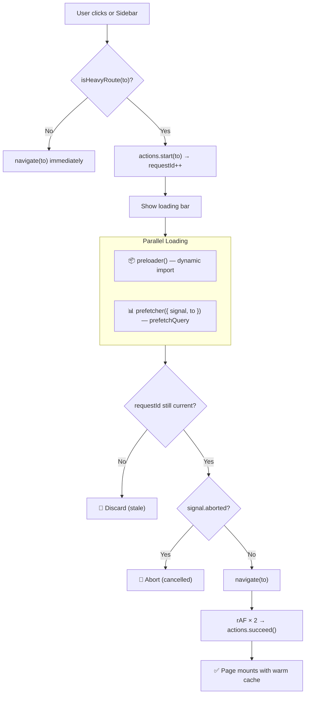
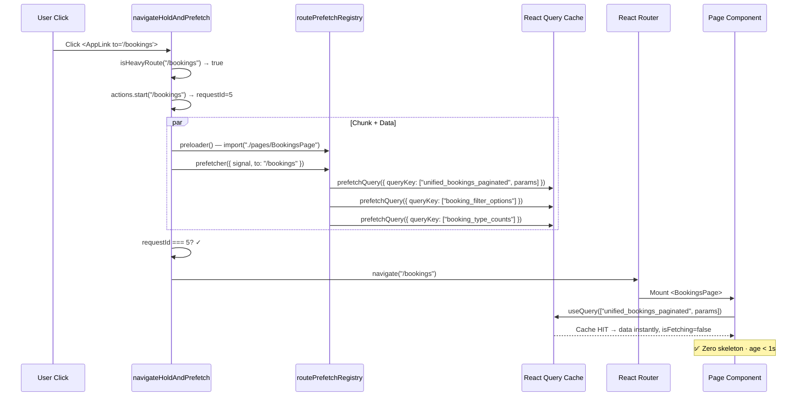
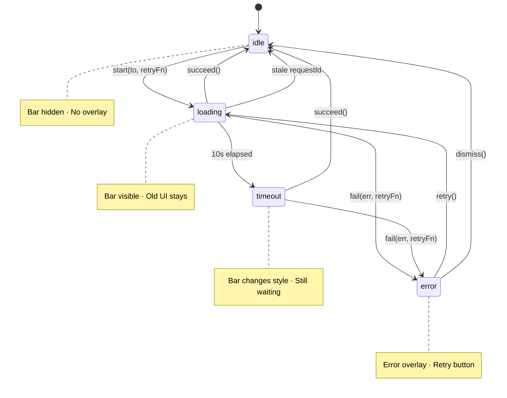

# Route Transition System v1.0 — Locked

> **Status:** Stable Infrastructure Layer  
> **Last validated:** 2026-02-25  
> **Coverage:** 17/17 heavy routes · Grade A (100%)  
> **Breaking changes require architecture review.**

---

## Table of Contents

1. [Overview](#overview)
2. [Navigation Flow](#navigation-flow)
3. [Prefetch + Hold + Swap Pipeline](#prefetch--hold--swap-pipeline)
4. [Query Cache Interaction](#query-cache-interaction)
5. [Loading Bar State Machine](#loading-bar-state-machine)
6. [Observability](#observability)
7. [File Map](#file-map)
8. [Invariants](#invariants)
9. [Regression Checklist](#regression-checklist)
10. [Adding a New Heavy Route](#adding-a-new-heavy-route)

---

## Overview

The Route Transition System eliminates skeleton/loading flashes when navigating between heavy routes. It achieves this by **holding the current UI visible** while prefetching both the JS chunk and query data for the target route. Only after both are ready does it call `navigate()` — the new page mounts with warm cache and zero visual disruption.

### Key Principles

- **Hold-and-swap:** Never show a blank page or skeleton during route transitions
- **Parallel loading:** JS chunk + data prefetch run concurrently via `Promise.all`
- **Latest wins:** Rapid clicks increment `requestId`; stale completions are discarded
- **Shared queryFn:** Page and prefetcher use the exact same function — cache shape is identical
- **Fail-fast in DEV:** Missing preloader or prefetcher throws an Error immediately

---

## Navigation Flow



---

## Prefetch + Hold + Swap Pipeline

```
┌─────────────────────────── navigateHoldAndPrefetch ───────────────────────────┐
│                                                                               │
│  1. isHeavyRoute(to)? ──No──> navigate(to) immediately                       │
│                          │                                                    │
│                         Yes                                                   │
│                          │                                                    │
│  2. actions.start(to, retryFn) → requestId = N                               │
│     Loading bar appears                                                       │
│                          │                                                    │
│  3. Promise.all([                                                             │
│       preloader()          ← dynamic import() from routePreloads              │
│       prefetcher(signal)   ← prefetchQuery() from routePrefetchRegistry      │
│     ])                                                                        │
│                          │                                                    │
│  4. Guard: requestId === N?  ──No──> return (stale)                           │
│                          │                                                    │
│  5. Guard: signal.aborted?  ──Yes──> return (cancelled)                       │
│                          │                                                    │
│  6. navigate(to)           ← React Router pushes new route                    │
│     Page mounts            ← useQuery reads WARM cache → no fetch             │
│                          │                                                    │
│  7. rAF(rAF(actions.succeed()))  ← Hide loading bar after paint               │
│                                                                               │
└───────────────────────────────────────────────────────────────────────────────┘
```

---

## Query Cache Interaction



---

## Loading Bar State Machine



---

## Observability

The Observability Layer provides production-safe metrics for every route transition and monitors React Query cache health.

### Transition Metrics

Every call to `navigateHoldAndPrefetch` records a `TransitionRecord`:

| Field | Type | Description |
|-------|------|-------------|
| `route` | string | Target path (e.g. `/bookings`) |
| `totalMs` | number | Total transition duration |
| `chunkMs` | number | JS chunk preload time |
| `dataMs` | number | Data prefetch time |
| `cacheHit` | boolean | `true` if `dataMs < 50ms` (warm cache) |
| `aborted` | boolean | Cancelled by user or superseded |
| `stale` | boolean | Superseded by newer request |
| `error` | boolean | Failed with exception |

Records are stored in a **ring buffer** (last 200 transitions, no memory leak).

### Aggregate Counters

| Metric | Description |
|--------|-------------|
| Avg total (ms) | Average successful transition time |
| P95 total (ms) | 95th percentile transition time |
| Avg chunk (ms) | Average chunk preload time |
| Avg data (ms) | Average data prefetch time |
| Cache hit ratio | % of transitions with warm cache |
| Abort frequency | % of transitions aborted/superseded |

### DEV Console: `[ROUTE TRANSITION METRICS]`

Auto-prints every 10 transitions. Manual access:

```js
// Browser console (DEV only)
window.__ROUTE_METRICS__.printMetricsSummary();
window.__ROUTE_METRICS__.computeAggregates();
window.__ROUTE_METRICS__.getRecords();
```

Example output:

```
[ROUTE TRANSITION METRICS]
┌────────────────────┬──────────┐
│ Total transitions  │ 10       │
│ Successful         │ 8        │
│ Aborted            │ 1        │
│ Stale (superseded) │ 1        │
│ Avg total (ms)     │ 845      │
│ P95 total (ms)     │ 2131     │
│ Avg chunk (ms)     │ 210      │
│ Avg data (ms)      │ 680      │
│ Cache hit ratio    │ 25%      │
│ Abort frequency    │ 10%      │
└────────────────────┴──────────┘
Per-route breakdown:
┌──────────────────┬─────────────┬───────┬──────────────┐
│ route            │ transitions │ avgMs │ cacheHitRate │
│ /bookings        │ 3           │ 1200  │ 33%          │
│ /stays           │ 3           │ 850   │ 33%          │
│ /reports/cashflow│ 2           │ 284   │ 0%           │
└──────────────────┴─────────────┴───────┴──────────────┘
```

### Cache Pressure Monitoring

The `cachePressureMonitor` tracks React Query cache health for heavy queries:

| Metric | Threshold | Warning |
|--------|-----------|--------|
| Heavy query count | > 50 | Too many active caches |
| Stale queries retained | > 20 | Potential memory waste |
| Estimated cache size | > 10 MB | Excessive memory usage |

Auto-monitors every 60s (only logs if threshold breached). Manual access:

```js
// Browser console (DEV only)
window.__CACHE_PRESSURE__.printCachePressureReport();
window.__CACHE_PRESSURE__.takeCachePressureSnapshot();
```

### Production Behavior

| Aspect | DEV | Production |
|--------|-----|------------|
| `[TRANSITION]` console groups | ✅ Full logs | ❌ Stripped |
| `[MOUNT]` console logs | ✅ Full logs | ❌ Stripped |
| `[ROUTE TRANSITION METRICS]` | ✅ Auto-print every 10 | ❌ Silent |
| `[CACHE PRESSURE]` | ✅ Warn on threshold breach | ❌ Silent |
| In-memory metric records | ✅ Recorded | ✅ Recorded |
| `window.__ROUTE_METRICS__` | ✅ Available | ❌ Not exposed |
| `window.__CACHE_PRESSURE__` | ✅ Available | ❌ Not exposed |
| AbortController cleanup | ✅ Always | ✅ Always |
| Timer cleanup (`clearTimeout`) | ✅ Always | ✅ Always |

---

## File Map

| File | Role |
|------|------|
| `src/lib/navigation/routeLoadingPolicy.ts` | Declares `HEAVY_ROUTES` — the source of truth |
| `src/lib/navigation/routePreloaders.ts` | Maps routes to `() => import("./pages/X")` chunk preloads |
| `src/lib/navigation/routePrefetchRegistry.ts` | Maps routes to `prefetchQuery()` data preloads |
| `src/lib/navigation/navigateHoldAndPrefetch.ts` | Core pipeline: hold + parallel load + navigate |
| `src/lib/navigation/heavyQueryOptions.ts` | Shared `HEAVY_QUERY_OPTIONS` constant |
| `src/lib/navigation/routeGovernance.ts` | DEV-only audit: validates all routes have preloader + prefetcher |
| `src/lib/navigation/usePrefetchMountLog.ts` | DEV-only hook: logs mount status of prefetched queries |
| `src/components/system/AppLink.tsx` | Drop-in `<Link>` replacement that routes through the pipeline |
| `src/contexts/RouteTransitionContext.tsx` | Loading bar state + actions (start/succeed/fail/timeout) |
| `src/App.tsx` | `routePreloads` array — lazy chunk definitions |
| `eslint-rules/no-raw-link-heavy-route.js` | ESLint rule: blocks raw `<Link>` to heavy routes |
| `src/lib/stays/fetchStaysOperations.ts` | Shared queryFn for `/stays` (page + prefetcher) |
| `src/lib/navigation/transitionMetrics.ts` | Per-transition timing + aggregate counters (avg, P95, hit ratio) |
| `src/lib/navigation/cachePressureMonitor.ts` | Cache count / size / stale retention monitoring + threshold warnings |

---

## Invariants

> These rules MUST NEVER be broken. Violations will be caught by `routeGovernance.ts` at boot (DEV) or by the ESLint rule at lint time.

| # | Rule | Enforcement |
|---|------|-------------|
| 1 | Every path in `HEAVY_ROUTES` must have a chunk preloader in `routePreloads` | `routeGovernance.ts` — DEV Error |
| 2 | Every path in `HEAVY_ROUTES` must have a data prefetcher in `routePrefetchRegistry` | `routeGovernance.ts` — DEV Error |
| 3 | Prefetcher `queryFn` must be the **same function** as the page's `useQuery` | Code review convention |
| 4 | Prefetcher `queryKey` must **exactly match** the page's `useQuery` key | `usePrefetchMountLog` verification |
| 5 | All heavy queries must use `HEAVY_QUERY_OPTIONS` (`staleTime: 30_000`, `refetchOnMount: false`) | Convention |
| 6 | No raw `<Link to="/heavy-route">` — always use `<AppLink>` | ESLint `local/no-raw-link-heavy-route` |
| 7 | `navigateHoldAndPrefetch` must abort previous request when a new one starts | `requestId` + `AbortController` |
| 8 | Loading bar must remain visible until `navigate()` is called | Double-rAF in succeed path |
| 9 | Timeout (10s) must NOT auto-cancel — only changes UI state | `actions.timeout()` only |
| 10 | Governance report must show **Grade A** on app boot | Console `[ROUTE GOVERNANCE REPORT]` |

---

## Regression Checklist

Use this checklist for any PR that touches the transition layer or adds/modifies heavy routes:

### Adding a new heavy route

- [ ] Add path to `HEAVY_ROUTES` in `routeLoadingPolicy.ts`
- [ ] Add `() => import("./pages/NewPage")` to `routePreloads` in `App.tsx`
- [ ] Add `registerRoutePrefetcher('/new-path', ...)` in `routePrefetchRegistry.ts`
- [ ] Use shared queryFn (extract if inline, import in both page and prefetcher)
- [ ] Use `HEAVY_QUERY_OPTIONS` for all queries on the page
- [ ] Add `usePrefetchMountLog('NewPage', [...])` in the page component
- [ ] Verify `[ROUTE GOVERNANCE REPORT]` shows Grade A after adding

### Modifying an existing heavy route

- [ ] If `queryKey` changed → update prefetcher's `queryKey` to match
- [ ] If queryFn changed → update shared function, verify prefetcher uses same
- [ ] If route path changed → update `HEAVY_ROUTES`, preloader path, prefetcher path
- [ ] Run `npx tsc --noEmit` — zero errors
- [ ] Check DEV console `[MOUNT]` log → `status=success`, `isFetching=false`

### General checks

- [ ] ESLint passes with `local/no-raw-link-heavy-route` rule
- [ ] No raw `<Link to="...">` pointing to any heavy route
- [ ] `HEAVY_ROUTES` count matches preloader count matches prefetcher count
- [ ] TypeScript build clean

---

## Adding a New Heavy Route

Step-by-step example: adding `/invoices` as a heavy route.

### 1. Declare as heavy

```ts
// src/lib/navigation/routeLoadingPolicy.ts
export const HEAVY_ROUTES = [
    // ... existing routes
    '/invoices',      // ← ADD
] as const;
```

### 2. Add chunk preloader

```tsx
// src/App.tsx — routePreloads array
const routePreloads = [
    // ... existing preloads
    { path: '/invoices', preload: () => import('./pages/InvoicesPage') },
];
```

### 3. Extract shared queryFn

```ts
// src/lib/invoices/fetchInvoices.ts
export async function fetchInvoices(params: InvoiceParams) {
    const { data, error } = await supabase.from('invoices').select('*')...;
    if (error) throw error;
    return data;
}
```

### 4. Use in page

```tsx
// src/pages/InvoicesPage.tsx
import { fetchInvoices } from '@/lib/invoices/fetchInvoices';
import { HEAVY_QUERY_OPTIONS } from '@/lib/navigation/heavyQueryOptions';
import { usePrefetchMountLog } from '@/lib/navigation/usePrefetchMountLog';

const invoicesQuery = useQuery({
    queryKey: ['invoices', params],
    queryFn: () => fetchInvoices(params),
    ...HEAVY_QUERY_OPTIONS,
});

usePrefetchMountLog('InvoicesPage', [
    { key: ['invoices', params], query: invoicesQuery },
]);
```

### 5. Register prefetcher

```ts
// src/lib/navigation/routePrefetchRegistry.ts
import { fetchInvoices } from '@/lib/invoices/fetchInvoices';

registerRoutePrefetcher('/invoices', async ({ signal }) => {
    await instrumentedPrefetch('invoices', {
        queryKey: ['invoices', defaultParams],
        queryFn: () => fetchInvoices(defaultParams),
        ...HEAVY_QUERY_OPTIONS,
    });
});
```

### 6. Verify

```bash
npx tsc --noEmit              # Zero errors
# Open DEV console:
# → [ROUTE GOVERNANCE REPORT]  ✅ Grade A
# Navigate to /invoices:
# → [TRANSITION] /invoices     ✅ chunk + data prefetched
# → [MOUNT] InvoicesPage       ✅ status=success, isFetching=false
```

---

> **⚠️ Breaking changes to the route transition layer require architecture review.**  
> This system is classified as **stable infrastructure**. Modifications to `navigateHoldAndPrefetch`, `RouteTransitionContext`, or the loading bar state machine must be reviewed against the invariants listed above.
