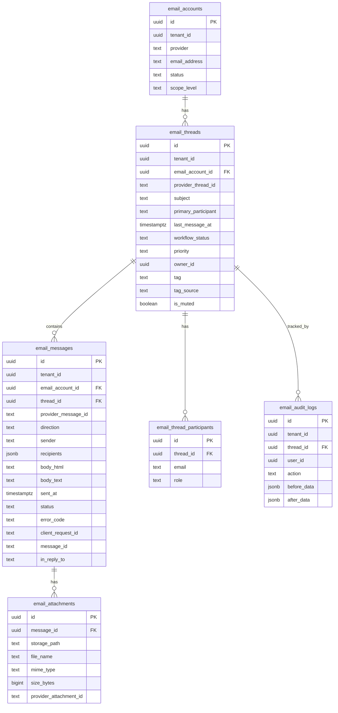

# Email V2 Target Architecture

## Entity Relationship



## Additive Schema Changes

### 1. ALTER `email_messages` — add outbound fields
```sql
ALTER TABLE email_messages ADD COLUMN IF NOT EXISTS sent_at timestamptz;
ALTER TABLE email_messages ADD COLUMN IF NOT EXISTS status text DEFAULT 'SYNCED'
  CHECK (status IN ('SYNCED','PENDING','SENT','FAILED','MOCK_SENT'));
ALTER TABLE email_messages ADD COLUMN IF NOT EXISTS error_code text;
ALTER TABLE email_messages ADD COLUMN IF NOT EXISTS client_request_id text;
```

### 2. ALTER `email_threads` — add tag_source
```sql
ALTER TABLE email_threads ADD COLUMN IF NOT EXISTS tag_source text DEFAULT 'SYSTEM'
  CHECK (tag_source IN ('SYSTEM','MANUAL'));
```

### 3. CREATE `email_attachments`
```sql
CREATE TABLE IF NOT EXISTS email_attachments (
  id uuid PRIMARY KEY DEFAULT gen_random_uuid(),
  message_id uuid NOT NULL REFERENCES email_messages(id) ON DELETE CASCADE,
  storage_path text,
  file_name text NOT NULL,
  mime_type text NOT NULL DEFAULT 'application/octet-stream',
  size_bytes bigint,
  provider_attachment_id text,
  created_at timestamptz NOT NULL DEFAULT now()
);
```

### 4. ALTER `email_audit_logs` — add SEND actions
```sql
ALTER TABLE email_audit_logs DROP CONSTRAINT IF EXISTS email_audit_logs_action_check;
ALTER TABLE email_audit_logs ADD CONSTRAINT email_audit_logs_action_check
  CHECK (action IN ('MARK_DONE','REOPEN','ASSIGN','CHANGE_PRIORITY','CHANGE_TAG','SEND_REPLY','SEND_FORWARD'));
```

## RLS Rules

| Table | SELECT | INSERT | UPDATE |
|---|---|---|---|
| `email_attachments` | `has_email_access()` | service_role only | service_role only |
| `email_messages` (extended) | `has_email_access()` | Authenticated + INSERT for outbound | — |

## Reply Flow Architecture

```
Client → ReplyComposerV2
  ↓ POST /email-reply
Edge Function (email-reply)
  ├── Validate JWT + RBAC
  ├── Enforce mailbox = thread.email_account_id
  ├── Check client_request_id dedup
  ├── Build MIME (reuse existing buildMimeMessage)
  ├── Gmail API send
  ├── Write to email_messages (V2) with status=SENT
  ├── Write to email_messages_mirror (V1 compat)
  ├── Write email_attachments rows
  ├── Write email_audit_logs
  └── Return { success, message_id }
```
